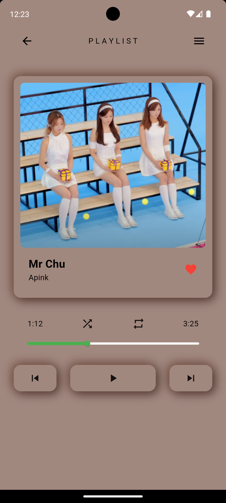
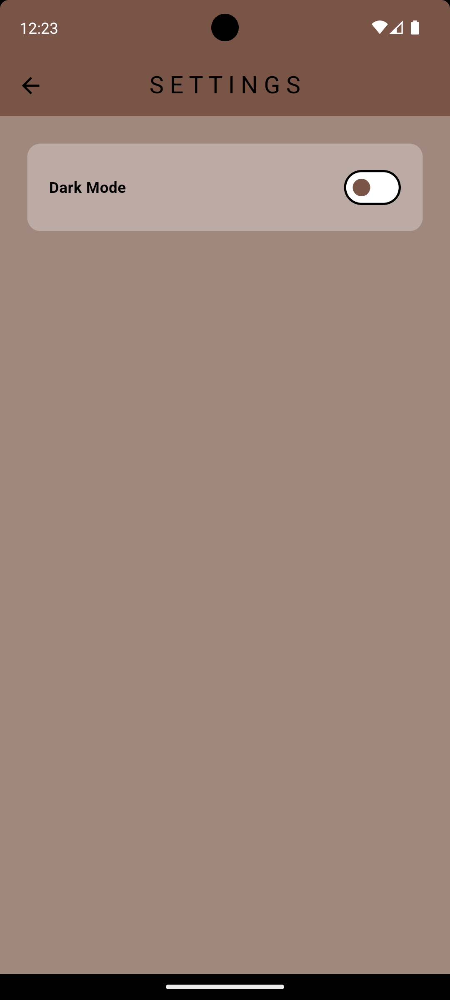

# Build Simple Music Player Appliaction

In developing a simple music player application using Flutter, I utilize the Audioplayers package to provide reliable music playback features. Integrating provider as state management allows us to efficiently manage the music playback status, enabling users to enjoy a seamless listening experience. Thus, I present a simple music player that is easy to develop further.

<!-- ### Video

 -->

### Result

    
    
    

### Getting Started

This project is a starting point for a Flutter application.
A few resources to get you started if this is your first Flutter project:

- [Lab: Write your first Flutter app](https://docs.flutter.dev/get-started/codelab)
- [Cookbook: Useful Flutter samples](https://docs.flutter.dev/cookbook)

For help getting started with Flutter development, view the
[online documentation](https://docs.flutter.dev/), which offers tutorials,
samples, guidance on mobile development, and a full API reference.
